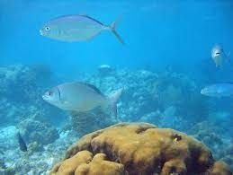
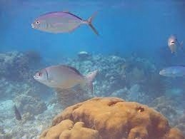
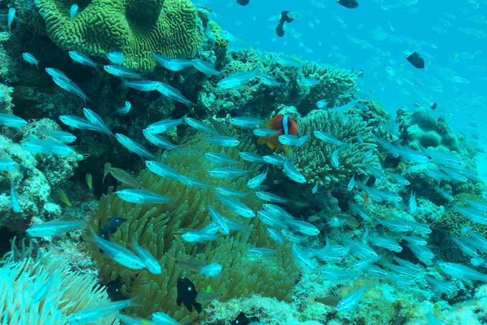
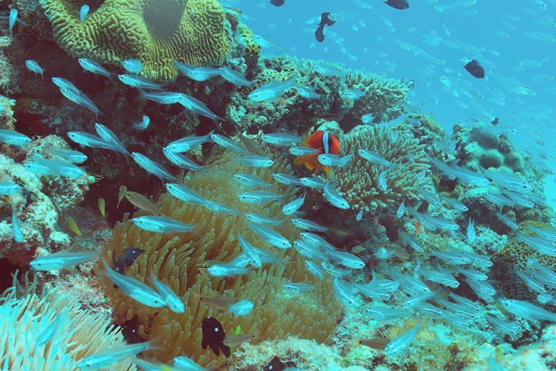
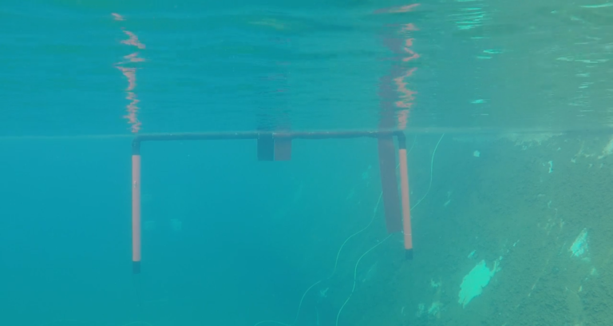
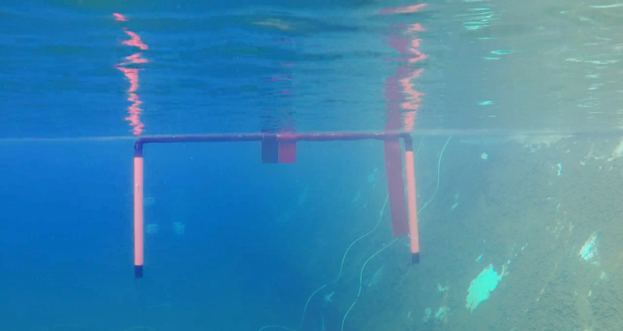
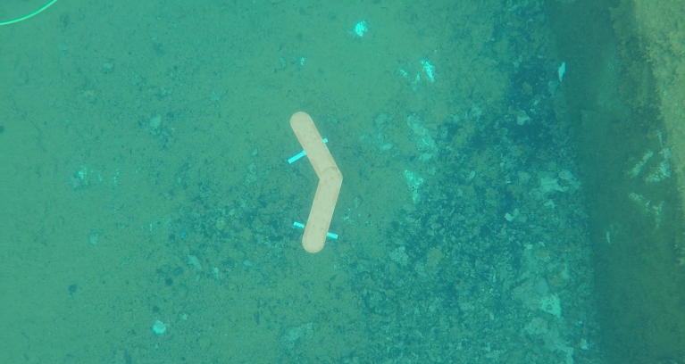
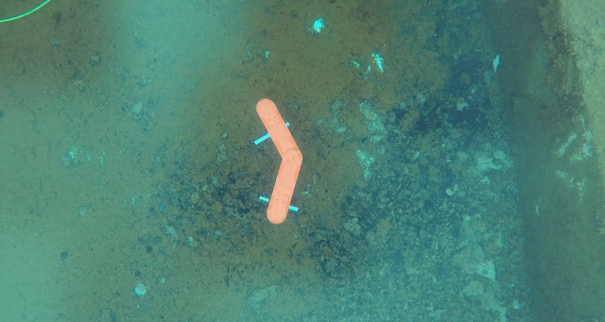
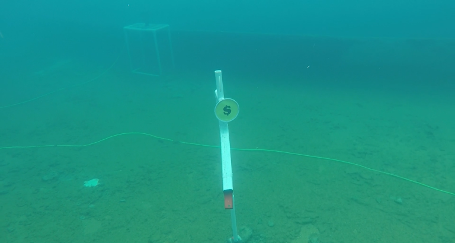
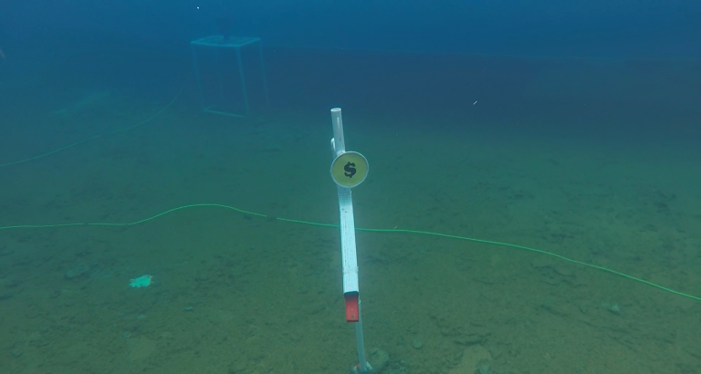

# Underwater Image colour Enhancement

OpenCV Python implementation of the image enhancement method from the paper [`N. Carlevaris-Bianco, A. Mohan, and R. M. Eustice. Initial results in underwater single image dehazing. In Proc.
MTS/IEEE OCEANS, 2010.`](https://deepblue.lib.umich.edu/bitstream/handle/2027.42/86035/ncarlevaris-3.pdf?sequence=1&isAllowed=y)

# Results

###  Image1
Input

Result

### Image 2
Input

Result

### Image 3
Input

Result

### Image 4
Input

Result

### Image 5
Input

Result

